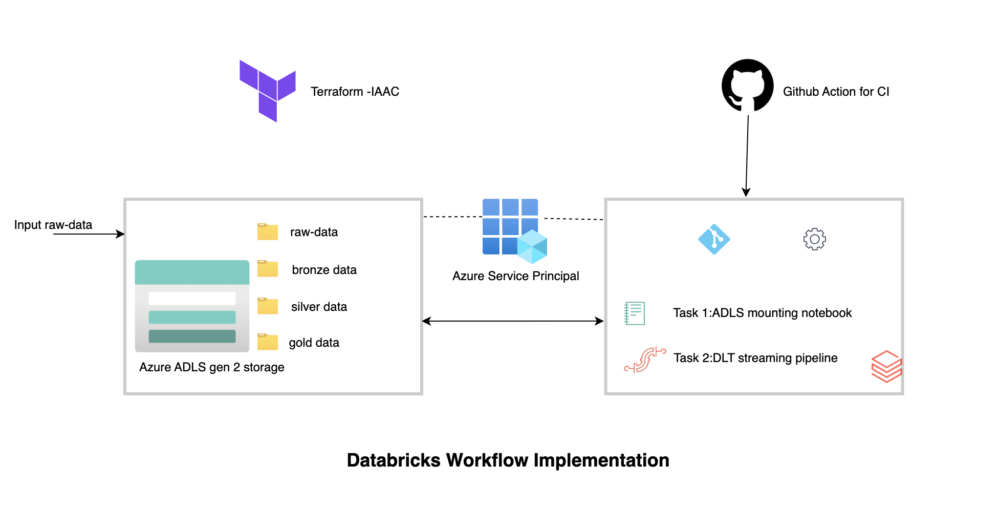

# Project Description

The project implements the `ETL transformation` of raw data (CSV) into refined data. It uses the `medallion architecture`, which accesses streaming source data from the `raw_data` folder and loads it into the `bronze_layer` in `parquet` format. This data is then processed into the silver and gold layers. The transformation is done using `Databricks Delta Live Tables (DLT)`. In fact, DLT is used in the `Databricks pipeline`, which is `Task 2` of the `Databricks Job`, while `Task 1` is to mount the raw data source. This project also includes notebooks integration using `Github actions`.
